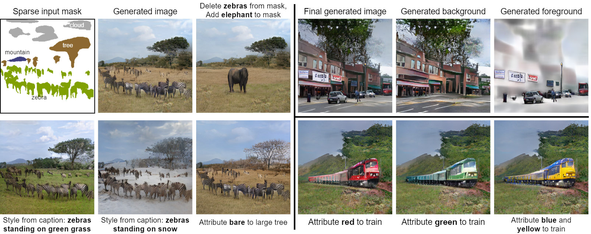

# Controlling Style and Semantics in Weakly-Supervised Image Generation

This is the project repository for the paper "Controlling Style and Semantics in Weakly-Supervised Image Generation", accepted at ECCV 2020 as a spotlight paper.

> Dario Pavllo, Aurelien Lucchi, and Thomas Hofmann. [Controlling Style and Semantics in Weakly-Supervised Image Generation](https://dariopavllo.github.io/papers/style-semantics.pdf). In European Conference on Computer Vision (ECCV), 2020.

Check out this repo in the upcoming weeks for the code release.




### Abstract
We propose a weakly-supervised approach for conditional image generation of complex scenes where a user has fine control over objects appearing in the scene. We exploit sparse semantic maps to control object shapes and classes, as well as textual descriptions or attributes to control both local and global style. In order to condition our model on textual descriptions, we introduce a semantic attention module whose computational cost is independent of the image resolution. To further augment the controllability of the scene, we propose a two-step generation scheme that decomposes background and foreground. The label maps used to train our model are produced by a large-vocabulary object detector, which enables access to unlabeled data and provides structured instance information. In such a setting, we report better FID scores compared to fully-supervised settings where the model is trained on ground-truth semantic maps. We also showcase the ability of our model to manipulate a scene on complex datasets such as COCO and Visual Genome.

### Reference
```
@inproceedings{pavllo2020stylesemantics,
  title={Controlling Style and Semantics in Weakly-Supervised Image Generation},
  author={Pavllo, Dario and Lucchi, Aurelien and Hofmann, Thomas},
  booktitle={European Conference on Computer Vision (ECCV)},
  year={2020}
}
```
